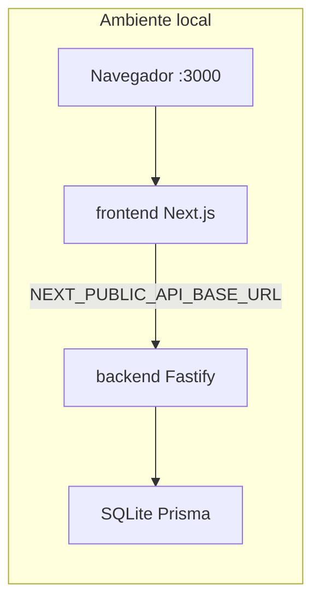

# LegalHub

SaaS de gestão jurídica para escritórios de advocacia. Centralize clientes, prazos e documentos em um único painel, com frontend em Next.js e API REST separada.

**Stack:** Next.js 14 · React · Tailwind CSS · Fastify · TypeScript · Prisma · SQLite

## Funcionalidades

- Landing page e autenticação
- Painel geral
- CRM de clientes (incluindo prontuário por cliente em `frontend/src/app/clientes/[id]/...`)
- Prazos em Kanban
- Documentos
- Configurações da aplicação (via API)

## Arquitetura

O repositório é um monorepo com dois pacotes npm independentes e scripts unificados na raiz:

```
legalhub-app/
├── frontend/              # Next.js 14, React, Tailwind
├── backend/               # Fastify, Prisma, Zod
├── package.json           # scripts dev:*, prisma:*, db:seed
├── PROJECT_STANDARDS.md   # padrões de desenvolvimento
└── backend/README.md      # API, módulos e rotas
```

Em desenvolvimento local, o navegador acessa o frontend na porta 3000; o frontend consome a API na porta 3001, que persiste dados em SQLite via Prisma.



## Pré-requisitos

- [Node.js](https://nodejs.org/) 20 ou superior
- npm

As dependências são instaladas separadamente em `frontend/` e `backend/` (não há npm workspaces na raiz).

## Como rodar

### 1. Clonar e entrar na pasta raiz

```bash
git clone <url-do-repositorio>
cd legalhub-app
```

### 2. Backend

```bash
cd backend
npm install
```

Copie `backend/.env.example` para `backend/.env` e ajuste se necessário:

| Variável | Descrição |
|----------|-----------|
| `PORT` | Porta da API (padrão: `3001`) |
| `DATABASE_URL` | URL do SQLite (padrão: `file:./prisma/dev.db`) |
| `JWT_SECRET` | Segredo para tokens — altere fora de desenvolvimento |
| `SESSION_TTL_HOURS` | Duração da sessão em horas |
| `CORS_ORIGIN` | Origem permitida do frontend (padrão: `http://localhost:3000`) |

Na **pasta raiz** do projeto, prepare o banco:

```bash
npm run prisma:generate
npm run prisma:migrate
npm run db:seed
```

O arquivo `backend/prisma/dev.db` é criado localmente e não é versionado (ver `.gitignore`).

### 3. Frontend

```bash
cd frontend
npm install
```

Copie `frontend/.env.example` para `frontend/.env`:

```env
NEXT_PUBLIC_API_BASE_URL=http://localhost:3001/api
```

### 4. Subir os serviços

Use **dois terminais**, ambos na pasta raiz:

```bash
npm run dev:backend
```

```bash
npm run dev:frontend
```

- API: [http://localhost:3001](http://localhost:3001)
- App: [http://localhost:3000](http://localhost:3000)

`CORS_ORIGIN` no backend deve corresponder à URL em que o frontend roda.

### 5. Verificação rápida

- Confira a API: `GET http://localhost:3001/health`
- Abra [http://localhost:3000](http://localhost:3000) no navegador

## Scripts na raiz

Todos os comandos abaixo são executados na pasta raiz do repositório.

| Script | Descrição |
|--------|-----------|
| `npm run dev:frontend` | Frontend em modo desenvolvimento |
| `npm run build:frontend` | Build de produção do frontend |
| `npm run start:frontend` | Sobe o frontend buildado |
| `npm run lint:frontend` | Lint do frontend |
| `npm run dev:backend` | API em modo desenvolvimento |
| `npm run build:backend` | Compila o backend para `dist/` |
| `npm run start:backend` | Sobe a API compilada |
| `npm run prisma:generate` | Gera o Prisma Client |
| `npm run prisma:migrate` | Aplica migrations em desenvolvimento |
| `npm run prisma:deploy` | Aplica migrations em deploy |
| `npm run db:seed` | Popula o banco com dados iniciais |

Para produção, rode `npm run build:frontend` e `npm run build:backend` antes de `start:frontend` e `start:backend`.

## Documentação relacionada

- [backend/README.md](backend/README.md) — stack da API, estrutura de módulos e rotas REST
- [PROJECT_STANDARDS.md](PROJECT_STANDARDS.md) — convenções de código e processo de trabalho

## Trocar banco de dados

Altere `DATABASE_URL` no `.env` do backend e o `provider` em `backend/prisma/schema.prisma`. Detalhes em [backend/README.md](backend/README.md).

## Problemas comuns

- **Porta em uso:** confira se 3000 (frontend) e 3001 (backend) estão livres ou ajuste `PORT` / URL do Next.
- **API inacessível no frontend:** verifique `NEXT_PUBLIC_API_BASE_URL` e reinicie o `dev:frontend` após mudar o `.env`.
- **Erro de CORS:** alinhe `CORS_ORIGIN` com a URL do frontend.
- **Banco vazio ou desatualizado:** rode `npm run prisma:migrate` e, se precisar de dados iniciais, `npm run db:seed`.
