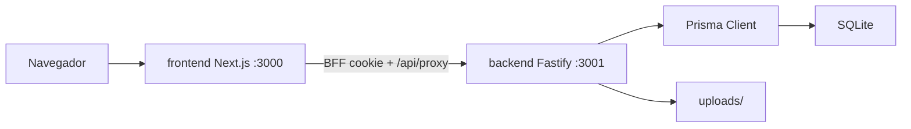
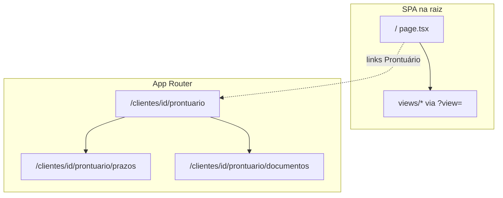

# Arquitetura

LegalHub é um SaaS de gestão jurídica para escritórios de advocacia. O repositório é um **monorepo** com dois pacotes npm independentes (sem npm workspaces na raiz): `frontend/` e `backend/`.

## Visão geral

| Camada | Tecnologia | Responsabilidade |
|--------|------------|------------------|
| UI | Next.js 14, React 18, Tailwind | Landing, login, painel CRM, Kanban, documentos |
| API | Fastify 4, TypeScript, Zod | REST, autenticação, validação, arquivos de prazo |
| Dados | Prisma 5, SQLite | Persistência relacional |
| Anexos | Sistema de arquivos | Binários de tarefas em `UPLOAD_DIR` |

## Comunicação entre serviços

Em desenvolvimento:

- Frontend: `http://localhost:3000`
- API: `http://localhost:3001`
- Chamadas autenticadas do browser: `/api/proxy/*` e `/api/session/*` no Next (porta 3000)
- BFF → Fastify: `API_INTERNAL_URL` (tipicamente `http://localhost:3001/api`) com `Authorization: Bearer` lido do cookie HttpOnly

O backend expõe CORS para a origem do frontend (`CORS_ORIGIN`). Ferramentas externas (Postman) ainda podem chamar a API diretamente com Bearer.

## Modelo de navegação do frontend

O frontend usa um modelo **híbrido**:

| Tipo | Exemplo | Mecanismo |
|------|---------|-----------|
| Views principais | Dashboard, clientes, Kanban, documentos | `/?view=dashboard` etc. (`ViewKey` em estado + query) |
| Deep link modal | Detalhe de tarefa | `/?view=kanban&task={id}` |
| Deep link drawer | Prontuário sobre a lista | `/?view=clients&prontuario={id}` |
| URLs dedicadas | Seções do prontuário por cliente | `/clientes/[id]/prontuario/...` com layout `(authenticated)` |

`middleware.ts` verifica presença do cookie de sessão em `/clientes/*`. `RouteGuard` em `RouteProviders` complementa no cliente.

## Onde vive a lógica de negócio

| Domínio | Backend | Frontend |
|---------|---------|----------|
| CRUD clientes, tarefas, documentos | `src/modules/*/ *.service.ts` | `AppContext` chama `api.ts` e atualiza estado |
| Autenticação | `auth.service`, JWT + `Session` | BFF `/api/session/*`, `authRepository`, `AuthProvider` |
| Validação de entrada | Zod em `*.schemas.ts` | Formulários + tipos em `types/index.ts` |
| Normalização de resposta | JSON direto do Prisma (datas ISO) | `normalizeTask`, `normalizeDocument` em `api.ts` |
| Upload de anexo | Multipart → disco + `TaskAttachment` | `FormData` em `uploadTaskAttachmentRequest` |
| SmartScan | `AppSetting.isSmartScanEnabled` | Toggle no `AppShell` |

## Bootstrap de dados no cliente

Após login, `AppProvider` chama `loadAppStateRequest`, que dispara **quatro requisições em paralelo**:

- `GET /api/clients`
- `GET /api/tasks`
- `GET /api/documents`
- `GET /api/settings`

O resultado alimenta `AppState` (clientes, tarefas, documentos, configurações). Mutações atualizam slices do estado (ex.: só `clients` após criar cliente) ou usam otimismo local (ex.: arrastar card no Kanban).

## Módulos funcionais (produto)

| Módulo | Backend | Frontend |
|--------|---------|----------|
| Auth | `/api/auth/*` | `src/auth/` |
| Clientes (CRM) | `/api/clients` | `ClientsView`, `ClientDrawer`, prontuário |
| Prazos (Kanban) | `/api/tasks` + comments/attachments | `KanbanView`, `TaskDetailModal` |
| Documentos | `/api/documents` | `DocumentsView`, `UploadModal` |
| Configurações | `/api/settings` | Toggle SmartScan |

## Ambiente e deploy

Variáveis críticas estão em `backend/.env` e `frontend/.env` (ver exemplos `.env.example` em cada pacote). Para preparar o banco na raiz: `npm run prisma:generate`, `npm run prisma:deploy`, `npm run db:seed`.

Detalhes de autenticação, schema e API: [authentication.md](authentication.md), [database.md](database.md), [openapi.yaml](openapi.yaml).

## Fase 2 (roadmap)

Planejado para evolução SaaS multi-escritório; **não implementado** na base atual.

| Tema | Direção |
|------|---------|
| Multi-tenancy | Modelo `Organization`, `officeId` em `User` e entidades; filtro em todos os services/repositories |
| Banco | Migração SQLite → PostgreSQL (ou equivalente) com backups e `prisma:deploy` em CI |
| Anexos | Object storage (S3-compatible) com URLs assinadas em vez de disco local |
| Compliance | Auditoria de acesso (quem leu/alterou PII), retenção e logs sem dados sensíveis |
| Cache cliente | TanStack Query ou invalidação declarativa se o volume de dados crescer |

RBAC atual: `admin` vs `member` no escritório único (`PATCH /api/settings` restrito a admin).
