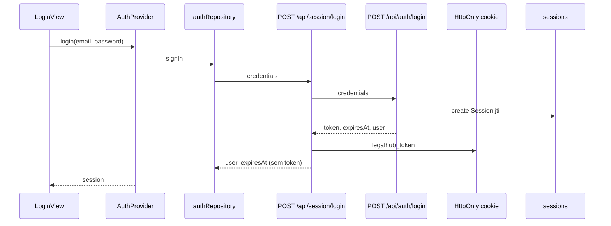

# Autenticação

LegalHub usa **JWT Bearer** com sessões persistidas no banco. O token **não** fica no `localStorage`: o Next.js (BFF) guarda o JWT em cookie **HttpOnly** e repassa `Authorization: Bearer` ao Fastify nas Route Handlers.

## Fluxo de login

1. O frontend envia `POST /api/session/login` com `{ email, password }` (limitado a **10 tentativas por IP a cada 15 minutos** no backend via `@fastify/rate-limit`).
2. A Route Handler chama `POST /api/auth/login` no Fastify.
3. O backend valida a senha com **scrypt**, gera JWT HS256 e cria `Session`.
4. O BFF define o cookie HttpOnly e responde `{ user, expiresAt }` **sem** expor o token ao JavaScript.

## Chamadas autenticadas à API

| Caminho | Uso |
|---------|-----|
| `GET /api/session/me` | Validar sessão (lê cookie, proxy para `GET /api/auth/session`) |
| `POST /api/session/logout` | Revogar sessão e limpar cookie |
| `/api/proxy/*` | Proxy para `/api/clients`, `/api/tasks`, etc. com Bearer server-side |

O cliente usa `fetch(..., { credentials: "include" })` em [`frontend/src/lib/api.ts`](../frontend/src/lib/api.ts).

## Validação em rotas protegidas (Fastify)

Rotas em `/api/*` (exceto `/api/auth/*`) passam pelo hook `requireAuth` em `backend/src/app.ts`:

1. Lê `Authorization: Bearer <token>` (enviado pelo BFF).
2. Verifica assinatura e expiração do JWT.
3. Carrega `Session` pelo `jti`; rejeita se revogada ou expirada.
4. Define `request.authUser` com `{ id, name, email, role }`.

`PATCH /api/settings` exige `role === "admin"` (`requireRole`).

## Sessão no frontend

| Artefato | Caminho |
|----------|---------|
| Repositório | `frontend/src/auth/authRepository.ts` |
| Context | `frontend/src/auth/AuthProvider.tsx` |
| Cookie (servidor) | `frontend/src/lib/session-cookie.ts` |
| Proxy API | `frontend/src/app/api/proxy/[...path]/route.ts` |

**Bootstrap:** `AuthProvider` chama `getSession()` → `GET /api/session/me`. Em 401, sessão nula.

**Logout:** `POST /api/session/logout` + cookie removido.

## Proteção de rotas Next.js

- **`middleware.ts`**: presença do cookie em rotas `(authenticated)/**`.
- **`/`** e profundas: `RouteGuard` / `AppGate` redirecionam se não houver sessão válida após bootstrap.

## Variáveis de ambiente

| Variável | Onde | Uso |
|----------|------|-----|
| `JWT_SECRET` | backend | Assinatura HS256 (mín. 32 caracteres em produção) |
| `SESSION_TTL_HOURS` | backend | TTL da sessão |
| `API_INTERNAL_URL` | frontend (servidor) | Base do Fastify para o BFF |
| `SESSION_COOKIE_NAME` | frontend (opcional) | Nome do cookie (padrão `legalhub_token`) |

## Credenciais de desenvolvimento

Após `npm run db:seed`:

| Perfil | Email | Senha |
|--------|-------|-------|
| Admin | `teste@legalhub.com` | `LegalHub@123` |
| Member | `membro@legalhub.com` | `LegalHub@123` |

## Referência OpenAPI

Endpoints Fastify: `POST /api/auth/login`, `GET /api/auth/session`, `POST /api/auth/logout` — ver [openapi.yaml](openapi.yaml).
