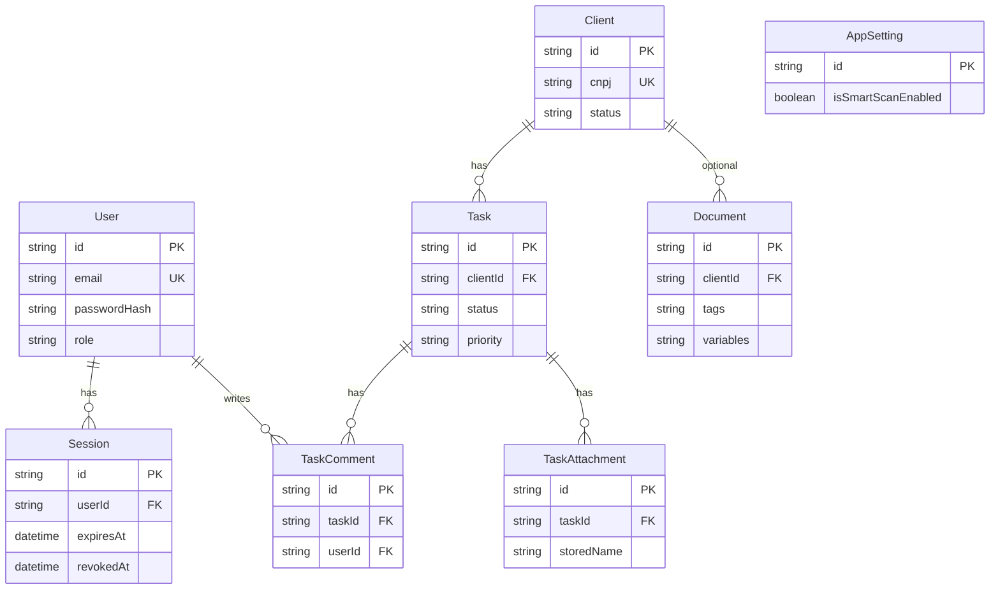

# Banco de dados

LegalHub usa **SQLite** via **Prisma 5**. O schema está em `backend/prisma/schema.prisma`.

## Localização do arquivo

`DATABASE_URL` no `.env` do backend é resolvido **relativo ao diretório do schema**. Com o padrão `file:./prisma/dev.db`, o arquivo costuma ficar em:

```
backend/prisma/prisma/dev.db
```

(não em `backend/prisma/dev.db` na raiz do pacote).

## Diagrama entidade-relacionamento



## Modelos

| Modelo | Tabela | Descrição |
|--------|--------|-----------|
| `User` | `users` | Usuários do escritório; senha em `passwordHash` |
| `Session` | `sessions` | Sessões ativas/revogadas; `id` = JWT `jti` |
| `Client` | `clients` | Clientes do CRM; `cnpj` único (CPF 11 ou CNPJ 14 dígitos) |
| `Task` | `tasks` | Prazos/tarefas do Kanban |
| `TaskComment` | `task_comments` | Comentários em tarefas |
| `TaskAttachment` | `task_attachments` | Metadados de anexos (binário no disco) |
| `Document` | `documents` | Metadados de documentos/templates |
| `AppSetting` | `app_settings` | Configuração global (ex. SmartScan) |

## Relações e exclusão

| Relação | `onDelete` |
|---------|------------|
| `Session` → `User` | Cascade |
| `Task` → `Client` | Cascade |
| `TaskComment` → `Task`, `User` | Cascade |
| `TaskAttachment` → `Task` | Cascade |
| `Document` → `Client` | SetNull |

Ao excluir um **cliente**, tarefas vinculadas são removidas em cascata. Documentos perdem `clientId` (ficam sem vínculo).

Ao excluir uma **tarefa**, o service remove arquivos em `UPLOAD_DIR` antes do delete no Prisma.

## Campos especiais

### Cliente — status

Valores de domínio (string): `Ativo`, `Em Prospecção`, `Inativo`.

### Tarefa — status e prioridade

| Campo | Valores |
|-------|---------|
| `status` | `todo`, `drafting`, `review`, `done` |
| `priority` | `critical`, `high`, `normal` |

### Documento — JSON serializado

No SQLite, listas e mapas são armazenados como **string JSON**:

| Campo API | Coluna DB | Formato |
|-----------|-----------|---------|
| `tags` | `tags` | `JSON.stringify(string[])` |
| `variables` | `variables` | `JSON.stringify(string[])` |
| `autoMappedFields` | `autoMappedFields` | `JSON.stringify(Record<string,string>)` ou null |

O service `documents.service.ts` faz parse/serialize na fronteira da API.

### TaskAttachment — disco

- `storedName`: nome único no filesystem (`UPLOAD_DIR`)
- `uploadedById`: opcional, sem FK para `User`

## Índices

Índices declarados no schema: `Session.userId`, `Session.expiresAt`, `Client.status`, `Task.clientId`, `Task.status`, `Task.priority`, `TaskComment.taskId`, `TaskAttachment.taskId`, `Document.clientId`.

## Comandos (pasta raiz)

| Comando | Uso |
|---------|-----|
| `npm run prisma:generate` | Gera Prisma Client |
| `npm run prisma:migrate` | Migrations interativas (dev) |
| `npm run prisma:deploy` | Aplica migrations sem prompt (CI/automação) |
| `npm run db:seed` | Dados demo (usuário, clientes, tarefas) |

## Trocar banco

Altere `provider` e `DATABASE_URL` em `schema.prisma` e `.env`. Veja também [backend/README.md](../backend/README.md).
